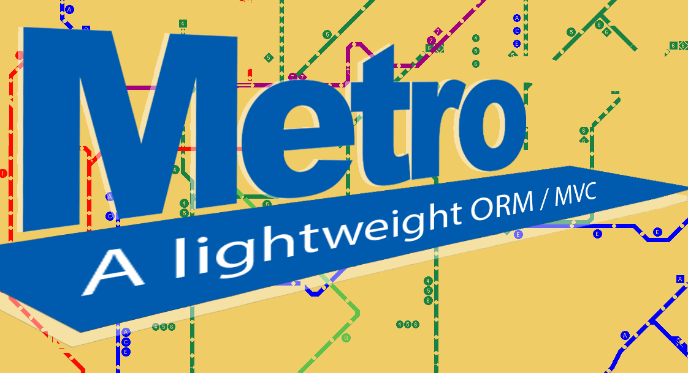

# Metro



## A Lightweight ORM / MVC

Metro combines a bare-bones ORM with a bare-bones MVC. Metro is written in Ruby, and uses Rack as a response/request interface.


#### Some highlights:

The router gives us RESTful convention for HTTP methods through metaprogramming.

```Ruby
[:get, :post, :put, :delete].each do |http_method|
  define_method(http_method) do |pattern, controller_class, action_name|
    add_route(pattern, http_method, controller_class, action_name)
  end
end
```

The server allows us to design custom routes, e.g.

```Ruby
router = Router.new
router.draw do
  get Regexp.new('^/counter$'), ExampleController, :counter
  get Regexp.new('^/howdoilook$'), ExampleController, :how_do_i_look
  get Regexp.new('^/cats$'), ExampleController, :all_cats
end
```

A no-frills middleware code block for easy stack-building.

```Ruby
app_stack = Rack::Builder.new do
  # put extra middleware here
  use ExceptionCatcher
  use StaticAssets
  run app
end
```

MetroBase gives us simple database methods such as has_many

```Ruby
def has_many(name, options = {})
  self.assoc_options[name] = BelongsToOptions.new(name.to_s, options)

  define_method name do
    options = self.class.assoc_options[name]

    foreign_key_value = self.send(options.primary_key)
    return nil unless foreign_key_value

    query = <<-SQL
      SELECT
        *
      FROM
        #{options.table_name}
      WHERE
        #{options.table_name}.#{options.foreign_key} = #{foreign_key_value}
    SQL

    results = DBConnection.execute(query)
    options.model_class.parse_all(results)
  end
end
```


### Seeing an example

Clone in, `bundle install`, and run `ruby lib/server.rb`

Check out:
* localhost:3000/howdoilook,
* localhost:3000/counter,
* localhost:3000/cats!
